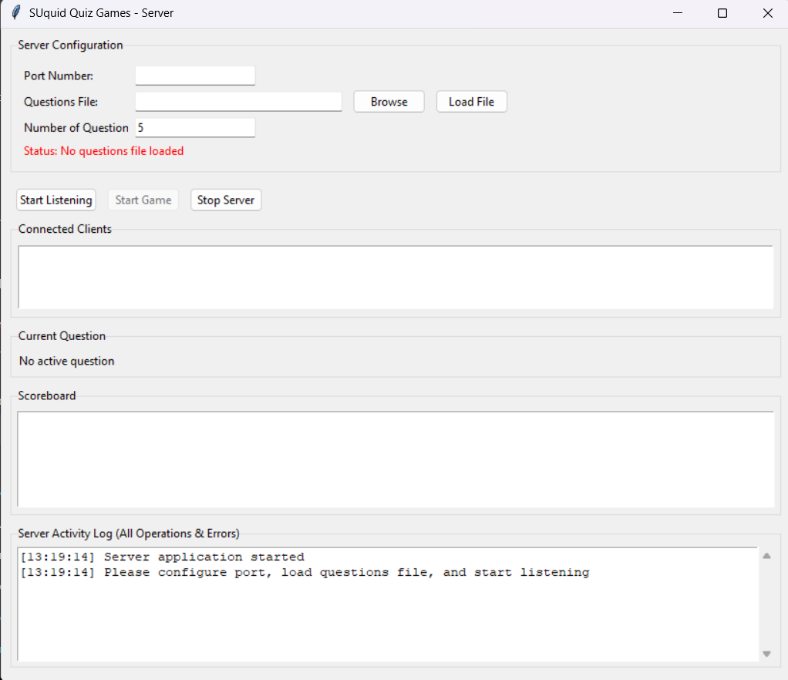
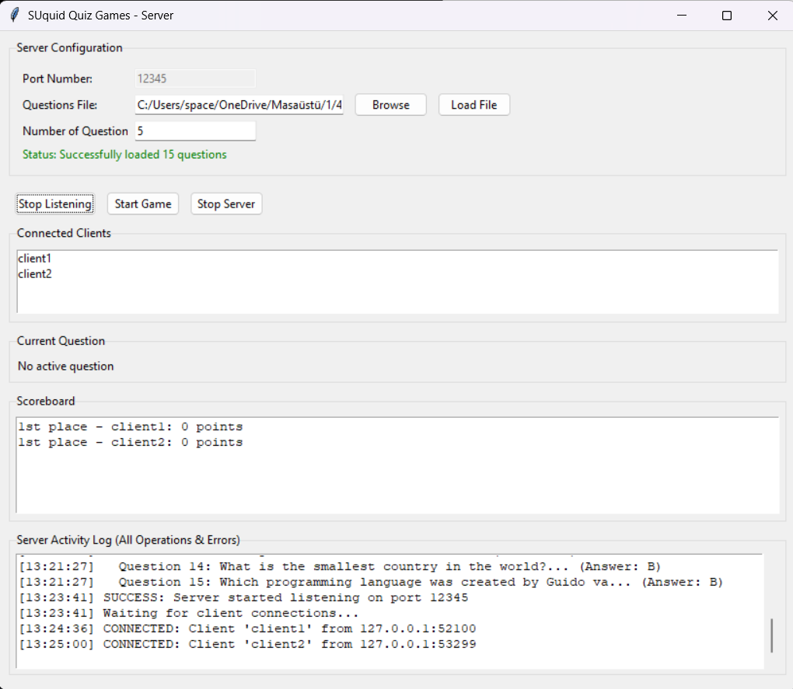
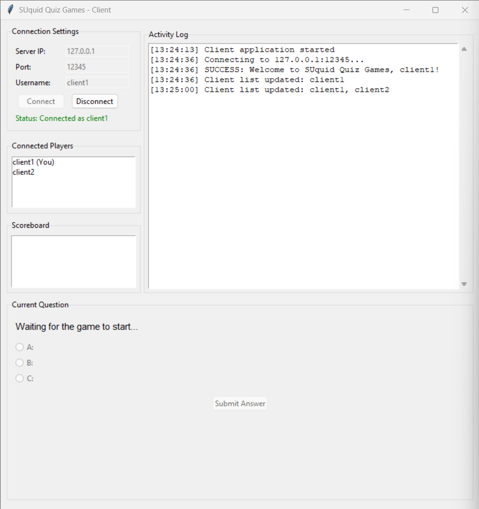
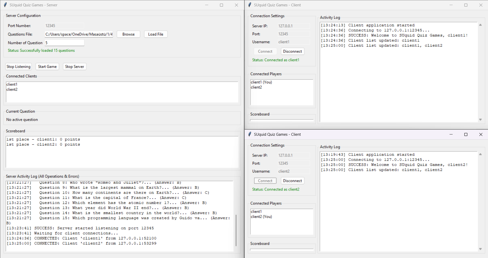
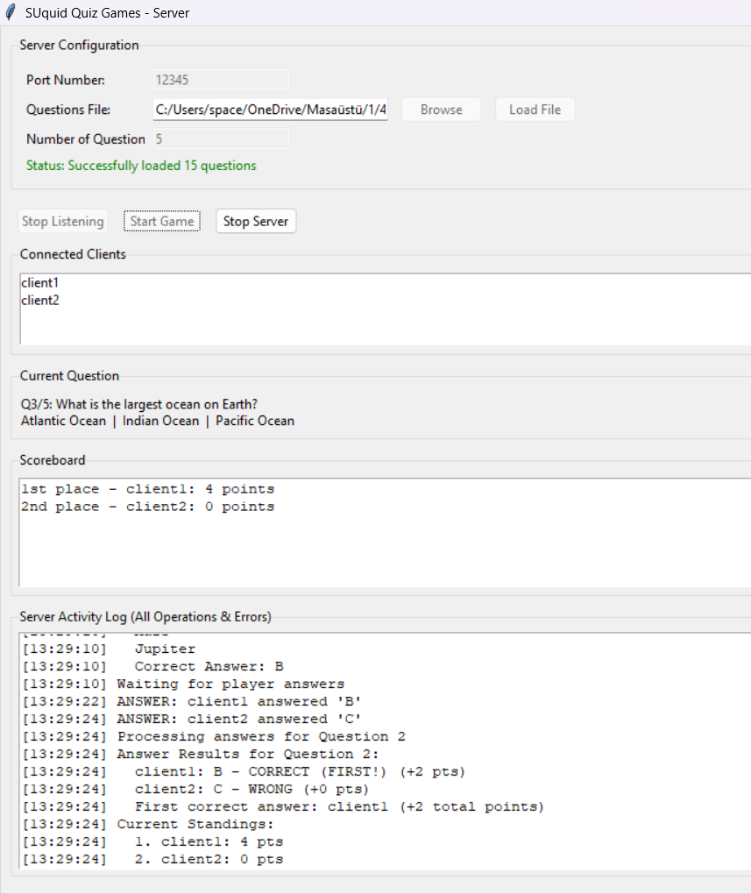
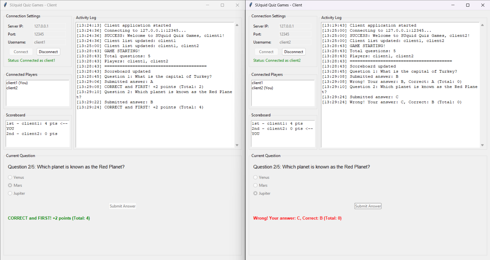
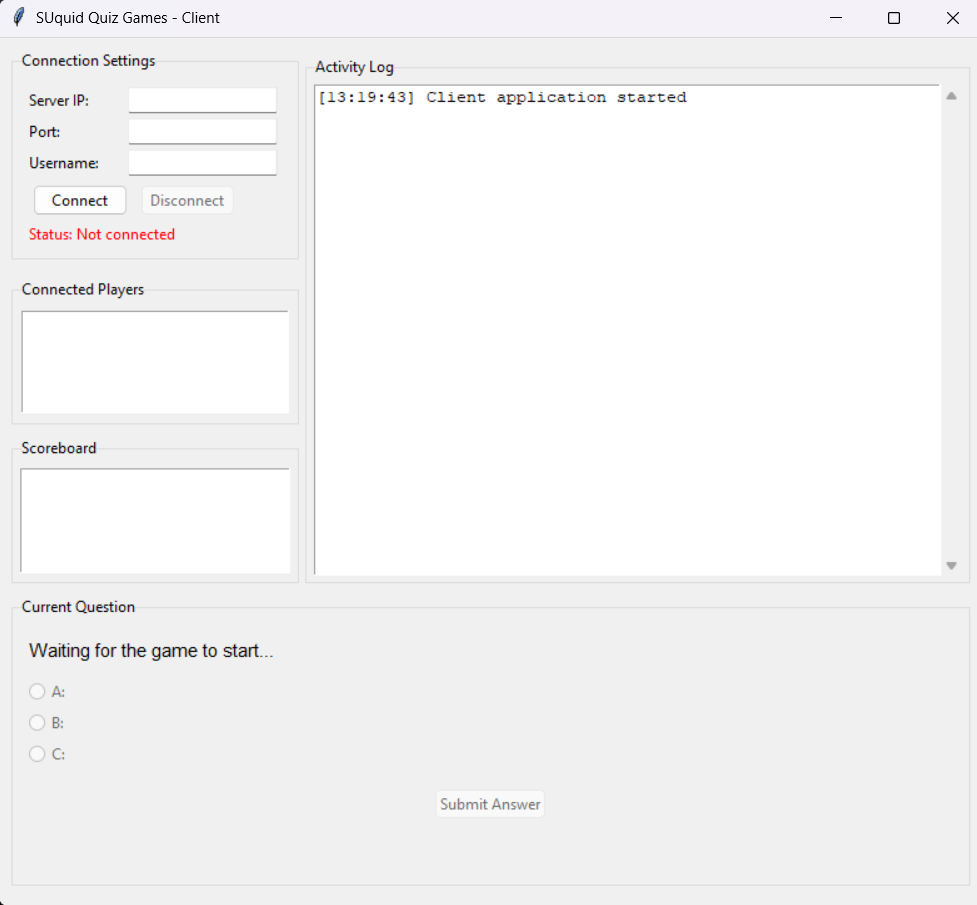

# 🎮 SUquid Quiz Game

A **multiplayer TCP-based quiz game** developed in **Python** for the **CS408 Computer Networks** course at Sabancı University.

The project demonstrates fundamental networking concepts including TCP socket programming, multi-threaded client handling, concurrent communication, and a client-server architecture with graphical user interfaces.

---

## ✨ Features

- 🌐 TCP Client-Server architecture
- 👥 Multiple players connected simultaneously
- 🧵 Multi-threaded server for concurrent clients
- 🖥️ Graphical User Interface (Tkinter)
- 📡 Real-time communication using sockets
- 📋 Question loading from external text file
- 🏆 Live scoreboard updates
- ⚡ First correct answer bonus system
- 🔄 Automatic game flow management
- 📝 Activity logs for both server and clients
- 🚫 Duplicate username prevention
- 🔒 Connection validation and error handling

---

## 🏗️ System Architecture

```
                     +-----------------------+
                     |        Server         |
                     |-----------------------|
                     | Question Manager      |
                     | Scoreboard            |
                     | Client Manager        |
                     | Game Controller       |
                     +----------+------------+
                                |
          -------------------------------------------------
          |                  |                  |
    +------------+     +------------+     +------------+
    |  Client 1  |     |  Client 2  |     |  Client 3  |
    +------------+     +------------+     +------------+
```

---

## 📁 Project Structure

```
.
├── server.py
├── client.py
├── questions.txt
├── README.md
├── LICENSE
├── .gitignore
└── screenshots/
    ├── server.png
    ├── client.png
    └── gameplay.png
```

---

## ⚙️ Technologies

- Python 3
- Socket Programming
- TCP/IP
- Threading
- Tkinter
- JSON

---

## 🚀 Getting Started

### 1. Clone the repository

```bash
git clone https://github.com/erenyildizSU/tcp-quiz-game.git
cd tcp-quiz-game
```

### 2. Start the server

```bash
python server.py
```

Configure:

- Port Number
- Question File
- Number of Questions

Then click:

```
Start Listening
```

---

### 3. Start one or more clients

Open another terminal for each player.

```bash
python client.py
```

Fill in:

- Server IP
- Port
- Username

Then press:

```
Connect
```

---

### 4. Start the game

Once at least two players have connected, click:

```
Start Game
```

The server will begin sending quiz questions to all connected players.

---

## 🎮 Game Rules

- Every player receives the same question.
- Each question has three choices (A, B, C).
- Every correct answer earns **1 point**.
- The first player to submit the correct answer receives additional bonus points.
- The player with the highest score wins.
- Multiple winners are allowed in case of a tie.

---

## 📄 Question File Format

Questions are loaded from a text file.

Example:

```
What is the capital of Turkey?
Ankara
Istanbul
Izmir
A
```

Each question consists of **5 lines**:

1. Question
2. Choice A
3. Choice B
4. Choice C
5. Correct Answer

---

## 🔍 Networking Concepts Demonstrated

- TCP Socket Programming
- Client-Server Architecture
- Concurrent Client Handling
- Thread Synchronization
- JSON Message Serialization
- Real-Time Communication
- Connection Management
- Error Handling
- Multi-user Communication

---

## 📸 Screenshots

The following screenshots illustrate the complete workflow of the application, from server initialization to an active multiplayer game session.

### 1. Server Startup

The server application immediately after launch, before any configuration has been applied.



---

### 2. Server Ready

The server configured with a port number, question file, and number of questions. It is now listening for incoming client connections.



---

### 3. Client Connected

A client connected successfully after entering the server IP address, port number, and username.



---

### 4. Initial Lobby

The server and multiple clients are connected successfully and waiting for the game to begin.



---

### 5. Gameplay

Server interface during an active quiz session.



Players answering questions during the game.



---

### 6. Client Interface

Initial appearance of the client application before connecting to the server.



---

## 📚 Learning Outcomes

This project was developed to gain practical experience with:

- Network programming
- TCP communication
- Concurrent programming
- GUI application development
- Client-server system design
- Real-time multiplayer applications

---

## 🔮 Possible Future Improvements

- User authentication
- Chat functionality
- Timer for each question
- Database integration
- Difficulty levels
- Question categories
- Web-based client
- Leaderboard persistence
- Encrypted communication (SSL/TLS)

---

## 👨‍💻 Authors

**Hüseyin Eren Yıldız**

Computer Science and Engineering

Sabancı University

GitHub: https://github.com/erenyildizSU

---

## 📜 License

This project is licensed under the MIT License.
